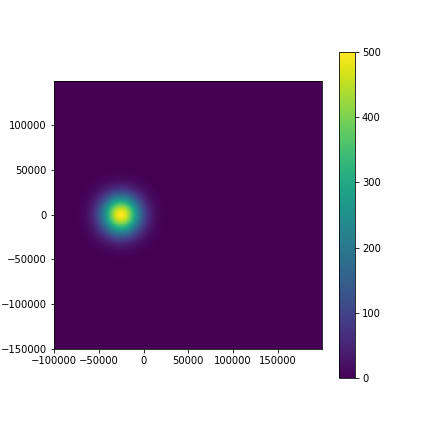
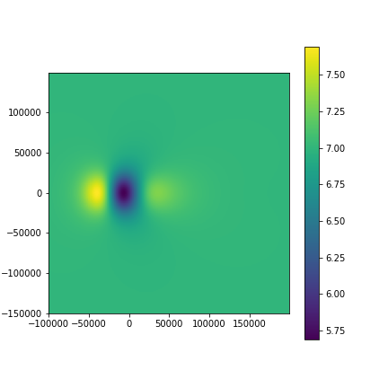

Linear Theory of Orographic Precipitation
=========================================

A `Python`_ framework that implements the Linear Theory of Orographic Precipitation
following `Smith & Barstad (2004)`_.

.. _`Python`: https://www.python.org
.. _`Smith & Barstad (2004)`: https://journals.ametsoc.org/doi/full/10.1175/1520-0469%282004%29061%3C1377%3AALTOOP%3E2.0.CO%3B2

The model includes airflow dynamics, condensed water advection, and downslope
evaporation. It consists of two vertically-integrated steady-state advection
equations describing: (i) the cloud water density and (ii) the hydrometeor
density. Solving these equations using Fourier transform techniques,
derives a single formula relating terrain and precipitation.

Please refer to the original manuscript of Smith and Barstad (2004) to understand
the model physics and limitations.

Installation
------------

Required dependencies:

* Python 3.6 or later
* `numpy`_

.. _`numpy`: https://numpy.org

orographic precipitation can be installed using ``pip``::

    $ pip install orographic_precipitation

Usage
-----

1. Import relevant functions to compute orographic precipitation,
   set up a topography and plot the resulting precipitation matrix.

.. code-block:: python

    import matplotlib.pyplot as plt
    from orographic_precipitation import compute_orographic_precip

2. Create example topography, for instance, an isolated circular Gaussian hill
(see original publication, Fig. 4 a-c).

.. code-block:: python

    def gauss_topography(dx, dy):
      """Returns synthetic topography for testing.
      Analogous to Fig 4 in Smith and Barstedt, 2004.
      """
      h_max = 500.
      x0 = -25e3
      y0 = 0
      sigma_x = sigma_y = 15e3

      x, y = np.arange(-100e3, 200e3, dx), np.arange(-150e3, 150e3, dy)
      X, Y = np.meshgrid(x, y)

      h = (h_max *
           np.exp(-(((X - x0)**2 / (2 * sigma_x**2)) +
                    ((Y - y0)**2 / (2 * sigma_y**2)))))

      return X, Y, h

    def plot2d(X, Y, field):
      """Function that plots precipitation matrices"""
      fig, ax = plt.subplots(figsize=(6, 6))
      pc = ax.pcolormesh(X, Y, field)
      ax.set_aspect(1)
      fig.colorbar(pc)

    dx = 750.
    dy = 750.

    X, Y, elevation = gauss_topography(dx, dy)

    plot2d(X, Y, elevation)

3. Initialize dictionary with relevant parameters, compute and plot orographic
   precipitation.

.. code-block:: python

    gamma = -5.8    #-6.49
    Gamma_m = -6.5  #-5
    rhosref = 7.4e-3

    param = {
    'latitude': 40,
    'p0': 7,                          # uniform precipitation rate
    'windspeed': 10,
    'winddir': 270,                   # wind direction (270: west)
    'tau_c': 1000,                    # conversion time
    'tau_f': 1000,                    # fallout time
    'nm': 0.005,                      # moist stability frequency
    'hw': 5000,                       # water vapor scale height
    'cw': rhosref * Gamma_m / gamma   # uplift sensitivity
    }

    P = compute_orographic_precip(elevation, dx, dy, **param)

    plot2d(X, Y, P)

Acknowledgement
---------------

This project is supported by the `Earth Surface Process Modelling`_ group at
the German Geoscience Research Institute in Potsdam, Germany.

.. _`Earth Surface Process Modelling`: http://www.gfz-potsdam.de/en/section/earth-surface-process-modelling/
