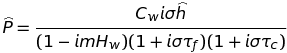
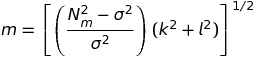

About orographic-precipitation
==============================

This plugin implements the linear model of orographic precipitation described in
Smith and Barstad, `"A Linear Theory of Orographic Precipitation"`_, Journal of
the Atmospheric Sciences 61, no. 12 (2004): 1377-1391.

------------------------------------------

.. _`"A Linear Theory of Orographic Precipitation"`: https://journals.ametsoc.org/doi/full/10.1175/1520-0469%282004%29061%3C1377%3AALTOOP%3E2.0.CO%3B2

.. contents:: Table of contents
   :backlinks: top
   :local:

Background
----------

Orographic precipitation occurs when moist air is lifted as it moves over a mountain
range. The lift of the air up the side of the mountain results in adiabatic cooling,
and ultimately condensation and precipitation.

In geomorphology, it is widely accepted that precipitation patterns exert
control on nearly all erosional processes and thereby influence landscape
evolution. In return, precipitation patterns in mountain ranges are strongly
controlled by topography, highly variable in space, and persistent over measurable
timescales.

The proposed model of orographic precipitation provides a theoretical
representation of the relationship between precipitation and topography. Therefore,
the spatial distribution of precipitation and topography evolve together.

Theory
------

The air is assumed saturated through the troposphere and has an adiabatic temperature
profile. Horizontal wind speeds and directions are constant in space and time.
Wind speed and direction, surface temperature, and the moist stability of the
atmosphere are imposed. The flow of air over topography is computed to determine
where and how rapidly air is rising. In regions of rising air, adiabatic cooling
leads to supersaturation and condensation of water vapor. A delay time represents
the characteristic time scale over which water vapor is converted into precipitation
hitting the ground. The delay time includes the characteristic time from the
initial condensation of cloud droplets to the growth of rain drops large enough
to have a downward directed velocity. Once, droplets are large enough to fall,
they are still advected by horizontal winds. The time taken for precipitation to
reach the ground depends on both the terminal velocity and the elevation at which
the precipitation forms and is also included in the delay time.

Model
-----

The model consists of two steady-state advection equations, one for the
vertically integrated cloud water density and one for the vertically integrated
hydrometeor density.

Application of the Fourier transform yields the transfer function that relates the
Fourier transform of the topography (``hhat``) to the transform of the precipitation field (``P_karot``).

The first factor in the denominator describes how the source term is modified by
airflow dynamics. Here, the vertical wave number ``m`` with

controls the depth and tilt of the forced air ascent. The two remaining factors
in the transfer function describe the advection of condensed water during conversion
and fallout.
The spatial field of precipitation are computed with the inverse Fourier transform.

The model is easy to apply to real terrain. All that is needed are terrain height and
the parameters describing the atmospheric conditions (see below).

.. csv-table:: Atmospheric conditions
  :header-rows: 1

  Name, Notation, Unit
  Precipitation, ``P``, mm hr :sup:`-1`
  Background precipitation rate, ``p0``, mm hr :sup:`-1`
  Uplift sensitivity factor, ``cw``, g m :sup:`-3`
  Intrinsic frequency, ``sigma``, s :sup:`-1`
  Moist stability frequency, ``nm``, s :sup:`-1`
  Water vapor scale height, ``hw``, m
  Conversion time, ``tau_c``, s
  Fallout time, ``tau_f``, s
  Vertical wave number, ``m``, m :sup:`-1`
  Wind components, ``u0 v0``, m s :sup:`-1`
  Terrain height, ``h``, m
